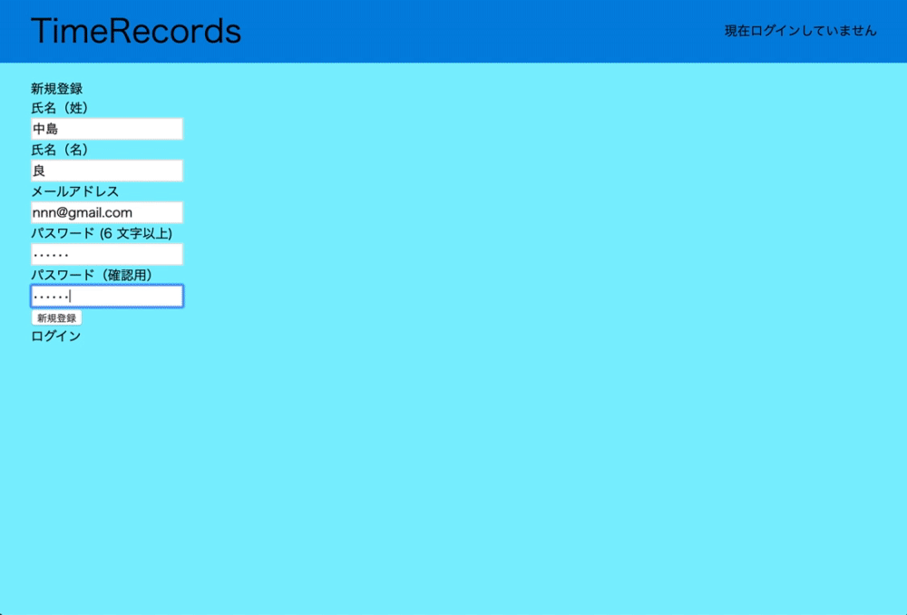
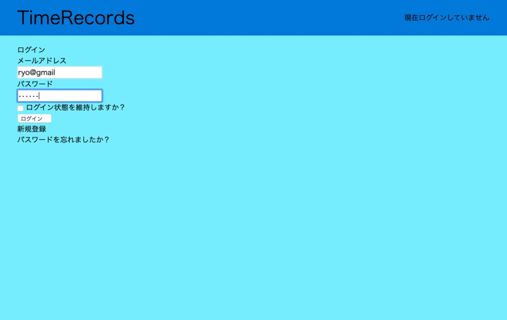
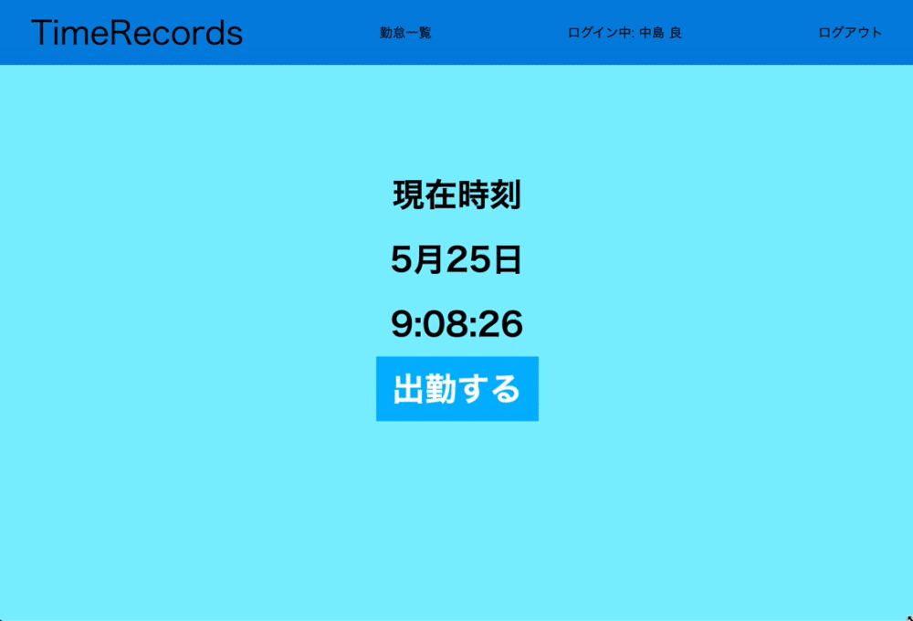
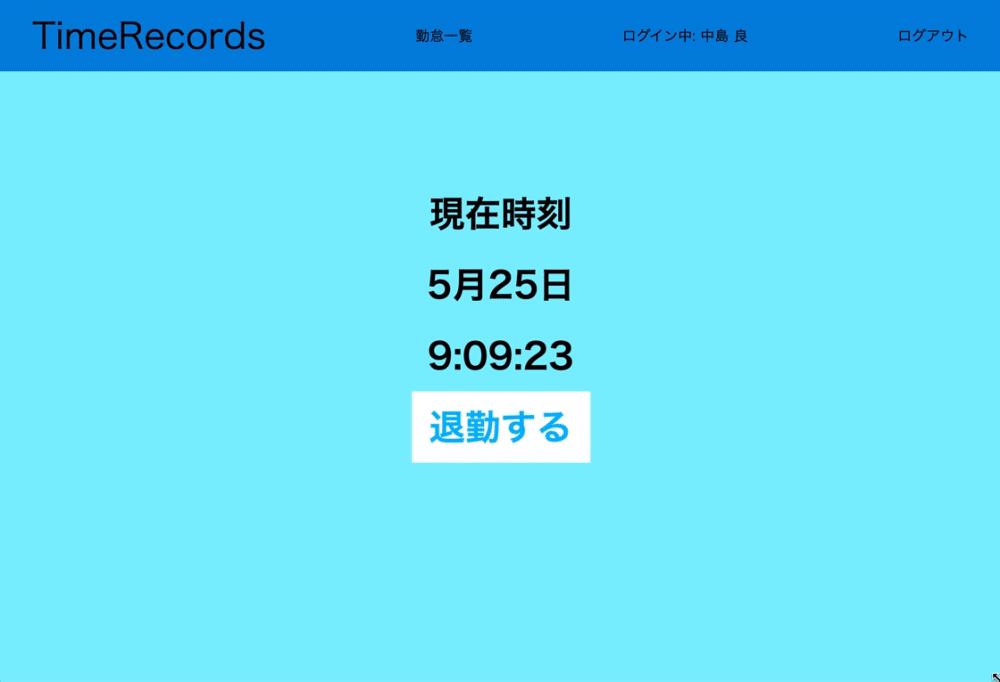
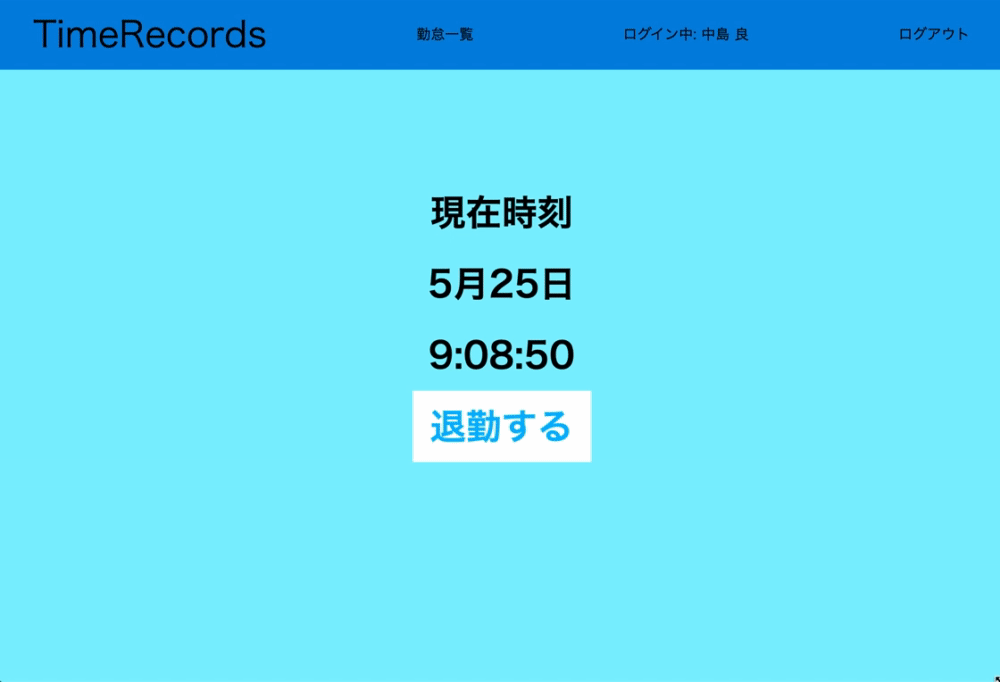

# README

# 使用技術
* Ruby on Rails
  →MVCモデルを活用したアプリを作りたかったため使用。
* devise
　→ログイン機能実装のため使用
* MySQL
  →登録情報の入力・出力を容易にするため使用。

# 要求1（ユーザの新規追加機能）
* APIの実装できておりません
* 新規追加は既存ユーザーを限定できておりません

# 要求2（ログイン機能）
*　APIの実装できておりません

# 要求3（打刻機能）
* APIの実装できておりません
* 休憩時間の実装ができておりません

# 要求4（勤怠一覧画面機能）
*　APIの実装できておりません
* 休憩時間の実装ができておりません

